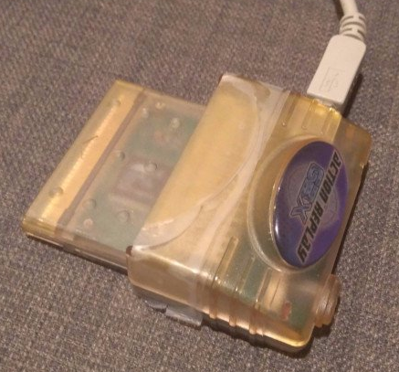
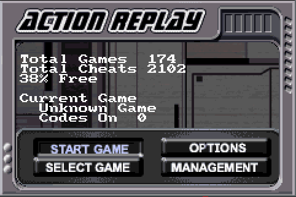

# Gameshark / Action Replay GBA V3 Tooling

This repository contains useful tooling to interact with Gameshark / Action
Replay cheating devices manufactured by Datel in the early 2000s for Nintendo's
Gameboy Advance.

 

## Repository Organization

This repository contains the following tools:

- `usbtool.c`: C program allowing to interact with the Action Replay / Gameshark
  cheating device over USB. Since the drivers shipped with the original PC utility
  only support 32-bit Windows operating systems, I simply made my own. Use this
  tool to:
  - Download code database from cheating device to computer (`-c`)
  - Upload code database from computer to cheating device (`-C`)
  - Download save game from game plugged into cheating device to computer (`-s`)
  - Upload save game from computer to game plugged into cheating device (`-S`)
  - Download cheating device firmware to computer (`-f`)
  - Read RAM contents of game currently plugged into cheating device (`-m`)
  - Read ROM contents of game currently plugged into cheating device (`-r`)
- `arcrypt.py`: Python script to encrypt and decrypt Action Replay / Gameshark
  cheat codes. Use [this document](https://macrox.gshi.org/The%20Hacking%20Text.htm#AR_V3_Code_Types)
  to translate decrypted codes to meaningful operations.
- `convert_code_db.py`: Python script to convert cheat codes downloaded by
  `usbtool -c` to JSON. Also supports backwards conversion from JSON to cheat
  codes blob for flashing with `usbtool -C`.
- `patch_ar_switch.py`: Python script to patch an Action Replay / Gameshark
  firmware such that it does not lock up with the "Please move the switch to the
  right" message in an emulator.

## Trivia

The Action Replay / Gameshark cheating devices is an instance of a cartridge
making use of the Debugging and Communication System (DACS) of the Gameboy
Advance hardware as described by
[Martin Korth](https://problemkaputt.de/gbatek.htm#gbacartbackupdacs). The DACS
was presumably introduced by Nintendo to offer developers a hardware debugger
for games.
